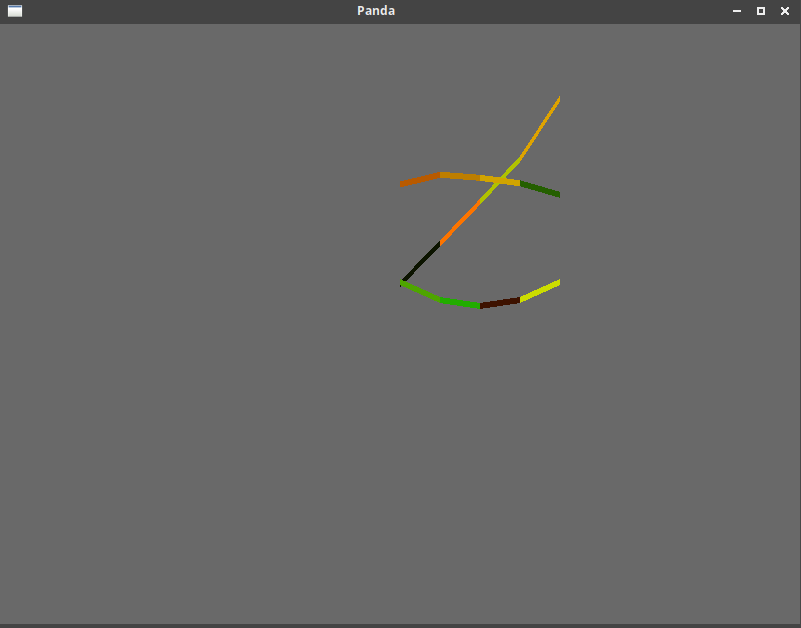
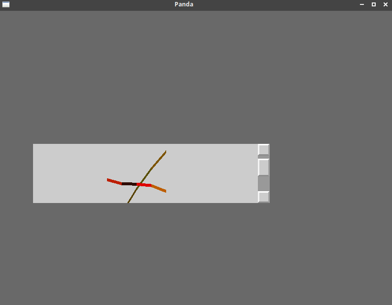

# Panda Plot

More of an example than a module.

`plot.py` should just work and only depend on panda.

there is an option for creating the objects directly in 2d space.
Alternatively, they can also be created inside a frame which can be 
scrolled. Detailed setup is requiured-ish.

